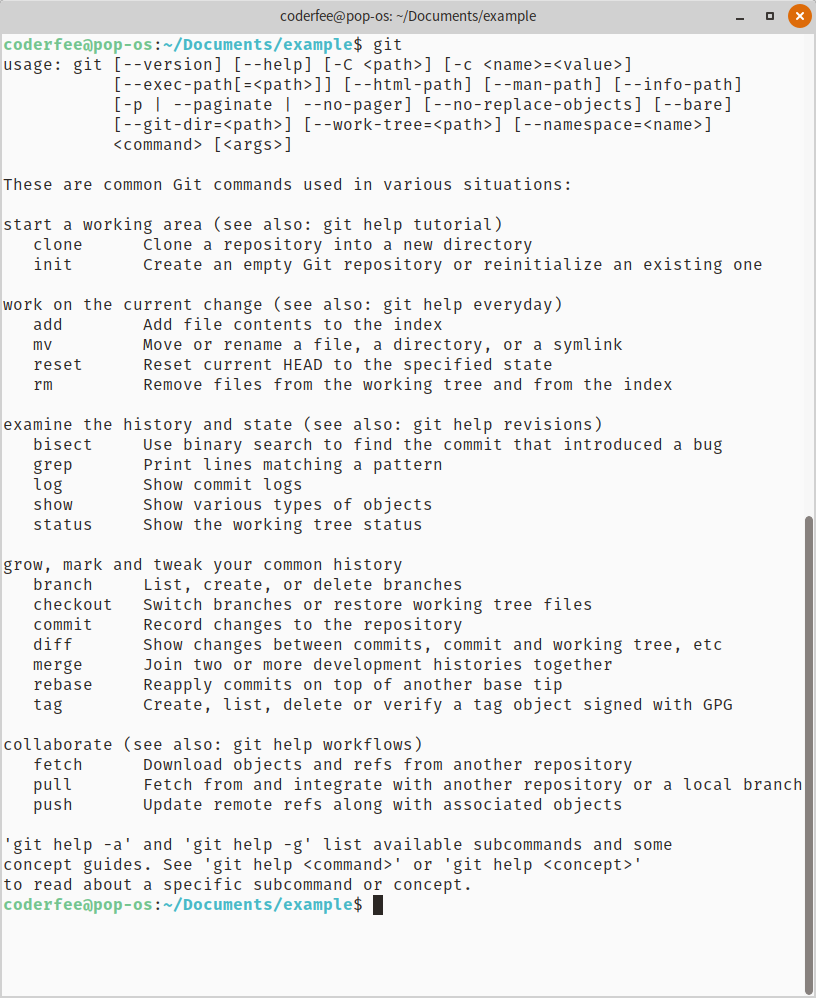
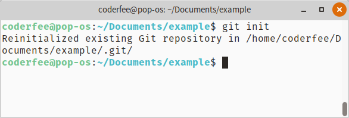
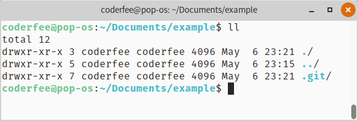
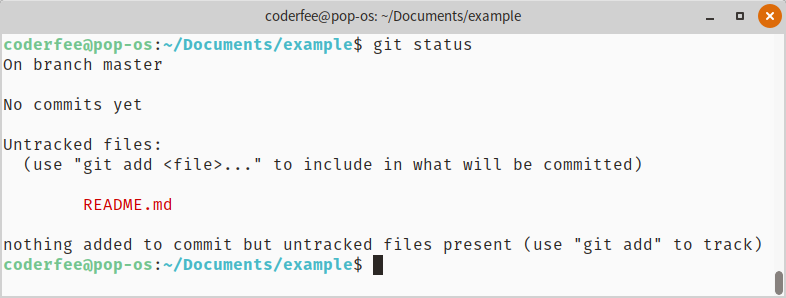
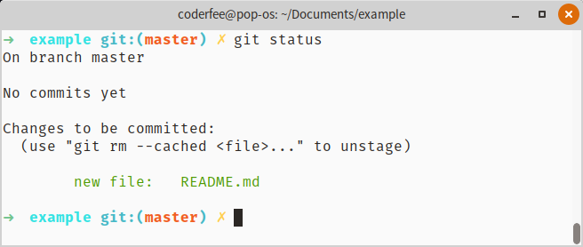

# Git 快速入门指南

> Git 是一个开源且免费的*版本控制系统（VCS）*，一种用来跟踪文件之前的版本的技术，同时它提供了回滚和维护不同版本的功能。

## 什么是 Git

Git 是一个开源且免费的版本控制系统（VCS），一种用来跟踪文件之前版本的技术，同时它提供了回滚和维护不同版本的功能。

Git 是以前非常流行的两种版本控制系统 SVN 和 CVS 的继承者。由 Linus Torvalds （Linux 的创始人）首先开发的，今天如果你要使用开源软件，你就无法绕开它。

## 分布式版本控制系统

Git 是一个分布式系统。许多开发者可以从中心位置克隆一个仓库，独立处理代码的某些部分，然后把这些更改提交到每个人都可以进行更新的中心位置。

Git 可以很容易地使开发人员在代码库上协同工作，而且也提供了可以合并他们所做的独立更改的工具。Github 使非常流行的用于托管 Git 仓库的一个服务，特别是对开源软件而言，但是我们也得提到 BitBucket 和 GitLab 等其他许多服务，他们被世界各地的团队广泛用于公开或私密托管代码。

## 安装 Git

在所有平台上安装 Git 使非常容易的：

## OSX

使用 [Homebrew](http://brew.sh/)，运行：

```shell
brew install git
```

## Windows

下载并安装 [Git for Windows](https://git-for-windows.github.io/)

## Linux

使用发行版的包管理器来安装 Git，例如：

```shell
sudo apt install git
```

或者：

```shell
sudo yum install git
```
---

## 初始化仓库

在系统上安装完 Git 之后，你可以通过在命令行键入 git 来访问它。



假设你有一个干净的文件夹。你可以键入下面的命令来初始化一个仓库

```shell
git init
```



这个命令做了什么呢？它在你运行命令的文件里创建了一个 `.git` 文件夹。如果你看不见，那是因为它是一个隐藏的文件夹，所以它可能不会显示在任何地方，除非你将工具设置为”显示隐藏的文件“。



在新创建的仓库中任何与 Git 有关的东西都会存储在 `.git` 目录下，除 `.gitignore` 之外，我将在下一篇文章里讨论这些内容。

---

## 添加文件到仓库

让我们开看看如何将一个文件添加到 Git，键入以下命令创建一个文件：

```shell
echo "Test" > README.md
```

这个文件现在位于运行命令的目录里，但 Git 目前并没有被告知将其添加在 Git 索引中，因为你可以看到 `git status` 告诉我们的信息：




### 添加文件到暂存区

我们需要如下命令使文件对 Git 可见，并且将其放到**暂存区**。

```shell
git add README.md
```

<!-- TODO: 添加图片 -->


一旦文件位于暂存区后，你可以通过键入以下命令来删除它：

```shell
git reset README.md
```

但是通常添加一个文件后你要做的是提交它。

---

## 提交更改

如果在暂存区有一个或多个更改，你可以使用以下命令来提交：

```shell
git commit -am "Description of the change"
```

这个命令将会清空暂存区的状态，并将所做的编辑永久记录到存储中，你可以通过键入 `git log` 来检查。

<!-- TODO: 添加图片 -->


<!-- TODO: 添加图片 -->


---

## 分支
